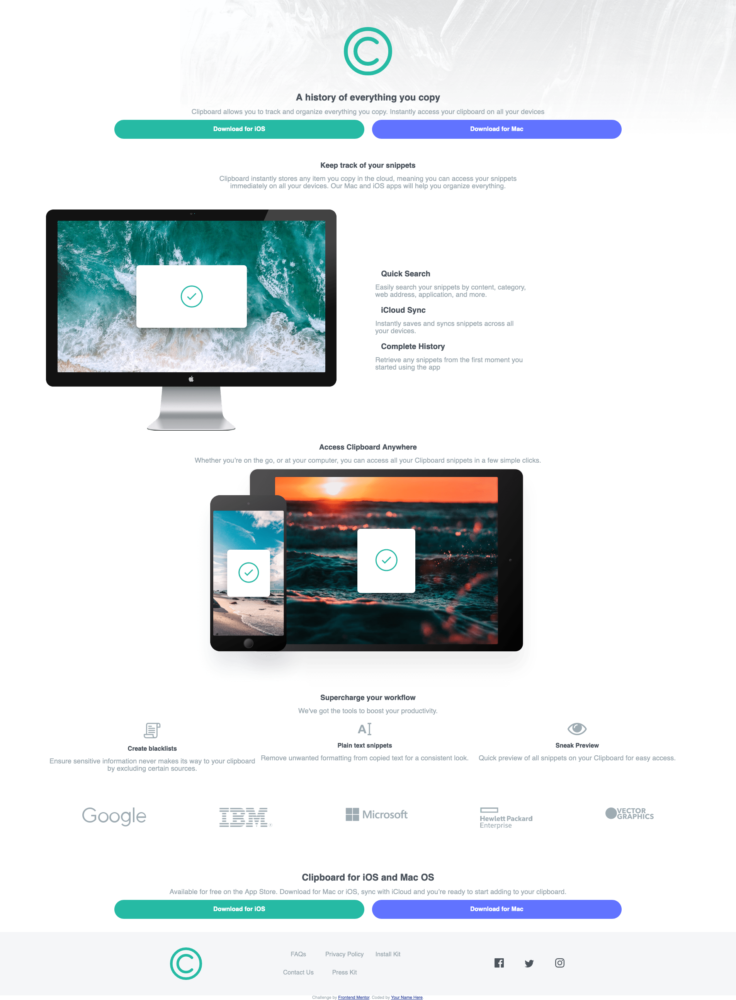

# Frontend Mentor - Clipboard landing page solution

This is a solution to the [Clipboard landing page challenge on Frontend Mentor](https://www.frontendmentor.io/challenges/clipboard-landing-page-5cc9bccd6c4c91111378ecb9). Frontend Mentor challenges help you improve your coding skills by building realistic projects. 

## Table of contents

- [Overview](#overview)
  - [The challenge](#the-challenge)
  - [Screenshot](#screenshot)
  - [Links](#links)
- [My process](#my-process)
  - [Built with](#built-with)
  - [What I learned](#what-i-learned)
  - [Useful resources](#useful-resources)
- [Author](#author)

**Note: Delete this note and update the table of contents based on what sections you keep.**

## Overview

### The challenge

Users should be able to:

- View the optimal layout for the site depending on their device's screen size
- See hover states for all interactive elements on the page

### Screenshot



### Links

- Live Site URL: [Add live site URL here](https://your-live-site-url.com)

## My process

### Built with

- Semantic HTML5 markup
- Flexbox
- Mobile-first workflow
### What I learned

One of the main issues was to make the various social media icons change color upond hovering. I originally used  tags before discovering SVGs and using those. 

```css
svg {
    fill:#4C545C;
    transition: all .5s;
}
svg:hover {
    fill: #26baa4;
}
```
### Useful resources

- [CSS Tricks](https://css-tricks.com/using-svg/) - This article helped me learn to work with SVGs and use the fill properties to make hover effects.


## Author

- Frontend Mentor - [@SanjayB06](https://www.frontendmentor.io/profile/SanjayB06)

